# mermaid

## Underwriting AI engine

## CRM AI Assistant

## Generative Docs

## Business Loan & Credit Agent

## API & XML Data Agent

```mermaid
erDiagram
    LOS_INTEGRATION_API_AGENT {
        string syncs "Encompass/Blend/nCino" 
    }
    PROPERTY_VALUATION_API_AGENT {
        string fetches "CoreLogic/ATTOM/Zillow/MLS" 
    }
    SERVICING_HANDOVER_API_AGENT {
        string transfers "Black Knight/LoanCare" 
    }
    CREDIT_BUREAU_API_AGENT {
        string retrieves "Equifax/TransUnion/Experian" 
    }
    COMPLIANCE_AUDIT_XML_AGENT {
        string creates "AML/KYC & HMDA XML" 
    }
    LOS_INTEGRATION_XML_AGENT {
        string translates "REST↔XML for LOS" 
    }
    CLOSING_DISCLOSURE_XML_AGENT {
        string produces "TRID-compliant CD XML" 
    }
    UNDERWRITING_DECISION_XML_AGENT {
        string outputs "Eligibility XML with DU/LP codes" 
    }
    LOAN_APPLICATION_XML_GENERATOR {
        string generates "MISMO 3.4 XML" 
    }
    DOCUMENT_ESIGNATURE_API_AGENT {
        string orchestrates "DocuSign/Adobe Sign" 
    }
    KYC_AML_API_AGENT {
        string verifies "Plaid/Persona/LexisNexis" 
    }
    PRICING_RATE_SHEET_API_AGENT {
        string calculates "Rates & pricing grids" 
    }
    ENGINE5 {
        string name "AI Engine 5" 
        string purpose "Extraction, normalization, orchestration" 
    }
    XML_AGENT {
        string type 
    }
    API_AGENT {
        string type 
    }
    CLOSING_DISCLOSURE_XML_AGENT o{--|| DOCUMENT_ESIGNATURE_API_AGENT : sends CD
    ENGINE5 ||--o{ LOS_INTEGRATION_XML_AGENT : uses
    ENGINE5 ||--o{ LOAN_APPLICATION_XML_GENERATOR : uses
    ENGINE5 ||--o{ PROPERTY_VALUATION_API_AGENT : integrates
    ENGINE5 ||--o{ API_AGENT : includes
    ENGINE5 ||--o{ LOS_INTEGRATION_API_AGENT : integrates
    ENGINE5 ||--o{ PRICING_RATE_SHEET_API_AGENT : integrates
    ENGINE5 ||--o{ KYC_AML_API_AGENT : integrates
    PROPERTY_VALUATION_API_AGENT ||--o{ UNDERWRITING_DECISION_XML_AGENT : provides AVM
    ENGINE5 ||--o{ UNDERWRITING_DECISION_XML_AGENT : uses
    ENGINE5 ||--o{ CLOSING_DISCLOSURE_XML_AGENT : uses
    ENGINE5 ||--o{ COMPLIANCE_AUDIT_XML_AGENT : uses
    ENGINE5 ||--o{ XML_AGENT : includes
    ENGINE5 ||--o{ DOCUMENT_ESIGNATURE_API_AGENT : integrates
    PRICING_RATE_SHEET_API_AGENT ||--o{ UNDERWRITING_DECISION_XML_AGENT : pricing inputs
    ENGINE5 ||--o{ CREDIT_BUREAU_API_AGENT : integrates
    UNDERWRITING_DECISION_XML_AGENT o{--|| CREDIT_BUREAU_API_AGENT : consumes scores
    LOS_INTEGRATION_XML_AGENT ||--o{ LOS_INTEGRATION_API_AGENT : bidirectional sync
    COMPLIANCE_AUDIT_XML_AGENT o{--|| KYC_AML_API_AGENT : logs verification
    LOAN_APPLICATION_XML_GENERATOR o{--|| LOS_INTEGRATION_API_AGENT : posts MISMO
    SERVICING_HANDOVER_API_AGENT o{--|| LOS_INTEGRATION_API_AGENT : post-closing transfer
    ENGINE5 ||--o{ SERVICING_HANDOVER_API_AGENT : integrates

```

## Crypto Payment Assistant

## Graphic & SEO Content Agent

## Compliance & Risk Monitor

